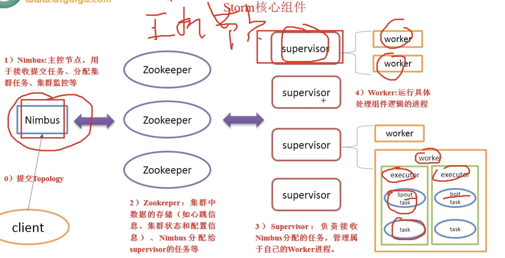
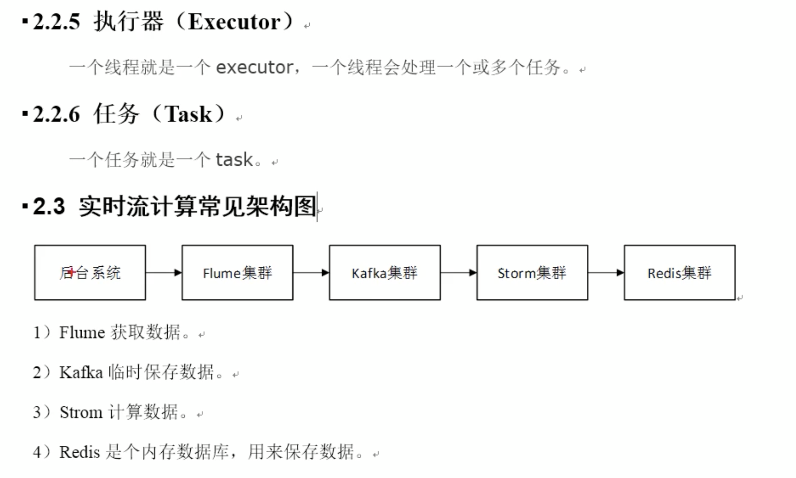

# 学习笔记

## [Storm（流计算）技术原理]([https://cshihong.github.io/2018/05/24/Storm%EF%BC%88%E6%B5%81%E8%AE%A1%E7%AE%97%EF%BC%89%E6%8A%80%E6%9C%AF%E5%8E%9F%E7%90%86/](https://cshihong.github.io/2018/05/24/Storm（流计算）技术原理/))

>## Spark Streaming 与 Storm的对比：
>
>- Spark Streaming和Storm最大的区别在于，Spark Streaming无法实现毫秒级的流计算，而Storm可以实现毫秒级响应。
>- Spark Streaming构建在Spark上，一方面是因为Spark的低延迟执行引擎（100ms+）可以用于实时计算，另一方面，相比于Storm，RDD数据集更容易做高效的容错处理。
>- Spark Streaming采用的小批量处理的方式使得它可以同时兼容批量和实时数据处理的逻辑和算法，因此，方便了一些需要历史数据和实时数据联合分析的特定应用场合。

## Storm核心组件

[storm并行度详解](https://blog.csdn.net/album_gyd/article/details/76170513)

>1、Storm 并行度相关的概念
>
>**Storm集群有很多节点，按照类型分为nimbus（主节点）、supervisor（从节点），在conf/storm.yaml中配置了一个supervisor,有多个槽（supervisor.slots.ports），每个槽就是一个JVM，就是一个worker(一个节点，运行一个worker)，在每个worker里面可以运行多个线程叫做executor，在executor里运行一个topology的一个component（spout、bolt）叫做task。task 是storm中进行计算的最小的运行单位，表示是spout或者bolt的运行实例。**
>
>**总结一下，supervisor(节点)>worker(进程)>executor(线程)>task(实例)**
>
>[程序](http://cpro.baidu.com/cpro/ui/uijs.php?adclass=0&app_id=0&c=news&cf=1001&ch=0&di=128&fv=14&is_app=0&jk=53f81b231d10c7dc&k=%B3%CC%D0%F2&k0=%B3%CC%D0%F2&kdi0=0&luki=5&mcpm=0&n=10&p=baidu&q=65035100_cpr&rb=0&rs=1&seller_id=1&sid=dcc7101d231bf853&ssp2=1&stid=9&t=tpclicked3_hc&td=1836545&tu=u1836545&u=http%3A%2F%2Fwww%2Ebubuko%2Ecom%2Finfodetail%2D822074%2Ehtml&urlid=0)执行的最大粒度的运行单位是进程，刚才说的task也是需要有进程来运行它的，在supervisor中，运行task的进程称为worker，
>
>Supervisor 节点上可以 运行非常多的worker进程，一般在 一个进程中是可以启动多个线程的，所以我们可以 在worker中运行多个线程，这些线程 称为executor， 在executor中运行task。
>
> 提高storm的并行度，可 考虑如下几点：
>
>worker(进程)>executor(线程)>task(实例)
>
>增加work进程，增加executor线程，增加task实例
>
> 看下面的图：
>
>这表示是一个work进程，其实就是一个 [jvm](http://cpro.baidu.com/cpro/ui/uijs.php?adclass=0&app_id=0&c=news&cf=1001&ch=0&di=128&fv=14&is_app=0&jk=53f81b231d10c7dc&k=jvm&k0=jvm&kdi0=0&luki=6&mcpm=0&n=10&p=baidu&q=65035100_cpr&rb=0&rs=1&seller_id=1&sid=dcc7101d231bf853&ssp2=1&stid=9&t=tpclicked3_hc&td=1836545&tu=u1836545&u=http%3A%2F%2Fwww.bubuko.com%2Finfodetail-822074.html&urlid=0)虚拟机进程，在这个work进程里面有多个executor线程，每个executor线程会运行一个或多个task实例。一个task是最终完成[数据处理](http://cpro.baidu.com/cpro/ui/uijs.php?adclass=0&app_id=0&c=news&cf=1001&ch=0&di=128&fv=14&is_app=0&jk=53f81b231d10c7dc&k=%CA%FD%BE%DD%B4%A6%C0%ED&k0=%CA%FD%BE%DD%B4%A6%C0%ED&kdi0=0&luki=2&mcpm=0&n=10&p=baidu&q=65035100_cpr&rb=0&rs=1&seller_id=1&sid=dcc7101d231bf853&ssp2=1&stid=9&t=tpclicked3_hc&td=1836545&tu=u1836545&u=http%3A%2F%2Fwww%2Ebubuko%2Ecom%2Finfodetail%2D822074%2Ehtml&urlid=0)的实体单元。(默认情况下一个executor运行一个task).
>
>**executor(线程)：默认情况下一个executor运行一个task，可以通过在代码中设置builder.setSpout(id,spout, parallelism_hint);或者builder.setBolt(id,bolt,parallelism_hint);来提高线程数的。**
>
>**task(实例)：通过boltDeclarer.setNumTasks(num);来设置实例的个数**

# storm学习系列博客

## [2.5 grouping策略和并发度](http://www.tianshouzhi.com/api/tutorials/storm/15)  （需再理解）

>**二、Grouping策略介绍**
>
>storm里面有6种类型的stream grouping:
>
>1.Shuffle Grouping: 随机分组， 随机派发stream里面的tuple， 保证每个bolt接收到的tuple数目相同。轮询，平均分配。
>
>\2. Fields Grouping：按字段分组， 比如按userid来分组， 具有同样userid的tuple会被分到相同的Bolts， 而不同的userid则会被分配到不同的Bolts。
>
>\3. All Grouping： 广播发送， 对于每一个tuple， 所有的Bolts都会收到。
>
>\4. Global Grouping: 全局分组， 这个tuple被分配到storm中的一个bolt的其中一个task。再具体一点就是分配给id值最低的那个task。
>
>\5. Non Grouping: 不分组， 这个分组的意思是说stream不关心到底谁会收到它的tuple。目前这种分组和Shuffle grouping是一样的效果，不平均分配。
>
>\6. Direct Grouping: 直接分组， 这是一种比较特别的分组方法，用这种分组意味着消息的发送者举鼎由消息接收者的哪个task处理这个消息。 只有被声明为Direct Stream的消息流可以声明这种分组方法。而且这种消息tuple必须使用emitDirect方法来发射。消息处理者可以通过TopologyContext来或者处理它的消息的taskid(OutputCollector.emit方法也会返回taskid)

## [2.6 消息的可靠性保障与acker机制](http://www.tianshouzhi.com/api/tutorials/storm/16)  （再理解）

